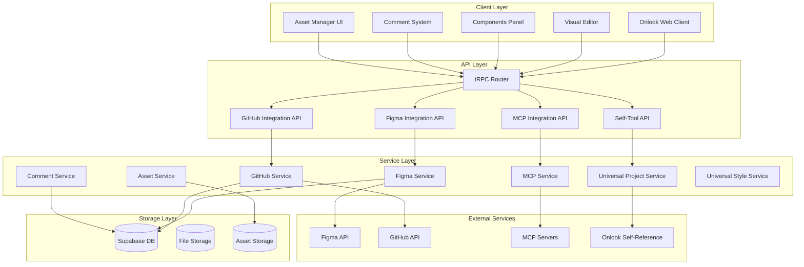

# Design Document

## Overview

This design document outlines the architecture for comprehensive platform extensions to Onlook, transforming it from a Next.js/Tailwind-focused visual editor into a universal design-to-code platform. The extensions include external integrations (Figma, GitHub), enhanced collaboration features, asset management, project setup automation, self-referential tooling capabilities, and support for diverse technology stacks.

The design leverages Onlook's existing architecture while adding new service layers, API endpoints, and UI components to support the expanded functionality. The system maintains backward compatibility while providing a foundation for future extensibility.

## Architecture

### High-Level Architecture



### Integration Points

The system integrates with Onlook's existing architecture through:

1. **tRPC Router Extension**: New routers added to `apps/web/client/src/server/api/root.ts`
2. **Package Extensions**: New packages in the `packages/` directory
3. **UI Component Integration**: New components integrated into existing editor interface
4. **Database Schema Extensions**: New tables and relationships in Supabase
5. **File System Integration**: Enhanced file handling for multi-framework support

## Components and Interfaces

### Core Services

#### FigmaIntegrationService

```typescript
interface FigmaIntegrationService {
  authenticate(token: string): Promise<FigmaAuth>;
  importFile(fileId: string): Promise<FigmaImportResult>;
  extractAssets(fileId: string): Promise<AssetCollection>;
  convertComponents(
    figmaComponents: FigmaComponent[]
  ): Promise<CodeComponent[]>;
  extractDesignTokens(fileId: string): Promise<DesignTokens>;
}
```

#### GitHubIntegrationService

```typescript
interface GitHubIntegrationService {
  createBranch(repo: string, branchName: string): Promise<Branch>;
  createPullRequest(
    repo: string,
    branch: string,
    changes: CodeChange[]
  ): Promise<PullRequest>;
  commitChanges(
    repo: string,
    branch: string,
    changes: CodeChange[]
  ): Promise<Commit>;
  syncRepository(repo: string): Promise<RepositoryState>;
}
```

#### UniversalProjectService

```typescript
interface UniversalProjectService {
  detectFramework(projectPath: string): Promise<FrameworkType>;
  generateCode(component: Component, framework: FrameworkType): Promise<string>;
  parseProject(
    projectPath: string,
    framework: FrameworkType
  ): Promise<ProjectStructure>;
  setupBuildTools(
    projectPath: string,
    framework: FrameworkType
  ): Promise<BuildConfig>;
}
```

#### UniversalStyleService

```typescript
interface UniversalStyleService {
  detectStyleSystem(projectPath: string): Promise<StyleSystemType>;
  convertStyles(styles: VisualStyles, system: StyleSystemType): Promise<string>;
  extractExistingStyles(projectPath: string): Promise<StyleDefinitions>;
  generateStyleCode(
    styles: StyleDefinitions,
    system: StyleSystemType
  ): Promise<string>;
}
```

### UI Components

#### ComponentsPanel

- Drag-and-drop interface for UI components
- Category-based organization
- Search and filtering capabilities
- Custom component support
- Framework-specific component libraries

#### CommentSystem

- Contextual commenting on elements
- Real-time collaboration
- Comment threading and resolution
- User mentions and notifications
- Visual comment indicators

#### AssetManager

- Image upload and organization
- Reference image overlay system
- Asset optimization and format conversion
- Project-wide asset management
- Integration with design imports

### API Endpoints

#### Figma Integration

- `POST /api/figma/authenticate` - Authenticate with Figma
- `POST /api/figma/import` - Import Figma file
- `GET /api/figma/assets/:fileId` - Extract assets from file
- `POST /api/figma/convert` - Convert Figma components to code

#### GitHub Integration

- `POST /api/github/branch` - Create new branch
- `POST /api/github/pr` - Create pull request
- `POST /api/github/commit` - Commit changes
- `GET /api/github/repos` - List accessible repositories

#### MCP Integration

- `POST /api/mcp/setup` - Setup MCP for project
- `GET /api/mcp/tools` - List available MCP tools
- `POST /api/mcp/execute` - Execute MCP tool

#### Self-Tool Integration

- `POST /api/self/branch` - Create branch using self-reference
- `POST /api/self/iterate` - Perform design iteration
- `GET /api/self/capabilities` - List self-tool capabilities

## Data Models

### Figma Integration Models

```typescript
interface FigmaFile {
  id: string;
  name: string;
  lastModified: Date;
  components: FigmaComponent[];
  assets: FigmaAsset[];
  designTokens: DesignToken[];
}

interface FigmaComponent {
  id: string;
  name: string;
  type: ComponentType;
  properties: ComponentProperty[];
  styles: StyleDefinition[];
  children: FigmaComponent[];
}

interface FigmaAsset {
  id: string;
  name: string;
  type: AssetType;
  url: string;
  format: string;
  size: number;
}
```

### GitHub Integration Models

```typescript
interface GitHubRepository {
  id: string;
  name: string;
  fullName: string;
  owner: string;
  defaultBranch: string;
  isPrivate: boolean;
  lastUpdated: Date;
}

interface PullRequest {
  id: string;
  number: number;
  title: string;
  description: string;
  branch: string;
  baseBranch: string;
  status: PRStatus;
  url: string;
}

interface CodeChange {
  filePath: string;
  content: string;
  operation: ChangeOperation;
  lineNumbers?: number[];
}
```

### Comment System Models

```typescript
interface Comment {
  id: string;
  elementId: string;
  userId: string;
  content: string;
  position: CommentPosition;
  status: CommentStatus;
  createdAt: Date;
  updatedAt: Date;
  replies: Comment[];
  mentions: string[];
}

interface CommentPosition {
  x: number;
  y: number;
  elementSelector: string;
  pageUrl: string;
}
```

### Asset Management Models

```typescript
interface Asset {
  id: string;
  projectId: string;
  name: string;
  type: AssetType;
  url: string;
  localPath: string;
  size: number;
  format: string;
  isReference: boolean;
  metadata: AssetMetadata;
}

interface AssetMetadata {
  dimensions?: { width: number; height: number };
  colorProfile?: string;
  compression?: string;
  source?: string;
}
```

### Universal Project Models

```typescript
interface ProjectStructure {
  framework: FrameworkType;
  styleSystem: StyleSystemType;
  buildTool: BuildToolType;
  packageManager: PackageManagerType;
  components: ComponentDefinition[];
  pages: PageDefinition[];
  assets: AssetReference[];
  config: ProjectConfig;
}

interface ComponentDefinition {
  name: string;
  path: string;
  props: PropDefinition[];
  dependencies: string[];
  framework: FrameworkType;
}
```

Now I need to complete the prework analysis before writing the correctness properties section:

<function_calls>
<invoke name="prework">
<parameter name="featureName">onlook-platform-extensions

## Corr

ectness Properties

_A property is a characteristic or behavior that should hold true across all valid executions of a system-essentially, a formal statement about what the system should do. Properties serve as the bridge between human-readable specifications and machine-verifiable correctness guarantees._

After analyzing the acceptance criteria, I've identified several key properties that can be consolidated to eliminate redundancy while maintaining comprehensive coverage:

**Property Reflection:**

- Properties 1.1-1.5 (Figma integration) can be combined into comprehensive Figma import properties
- Properties 2.1-2.5 (GitHub integration) can be consolidated into GitHub workflow properties
- Properties 3.1-3.5 (Components Panel) represent distinct UI behaviors that should remain separate
- Properties 4.1-4.5 (Comment System) can be combined into comment lifecycle properties
- Properties 5.1-5.5 (Asset Management) can be consolidated into asset handling properties
- Properties 6.1-6.5 (MCP Integration) represent distinct setup and configuration behaviors
- Properties 7.1-7.5 (Self-Toolcall) can be combined into self-reference safety properties
- Properties 8.1-8.5 (Universal Project Support) can be consolidated into framework detection and adaptation properties
- Properties 9.1-9.5 (Universal Styling Support) can be consolidated into styling system properties
- Properties 10.1-10.5 (Repository Integration) can be combined into repository submission properties

**Property 1: Figma Import Consistency**
_For any_ valid Figma file URL, the import process should successfully authenticate, extract all design elements (components, styles, assets, design tokens), and convert them to Onlook-compatible formats without data loss
**Validates: Requirements 1.1, 1.2, 1.3, 1.4, 1.5**

**Property 2: GitHub Workflow Completeness**
_For any_ set of changes made in Onlook, the GitHub integration should successfully create branches, track changes, generate meaningful commit messages, and create pull requests with comprehensive descriptions and design references
**Validates: Requirements 2.1, 2.2, 2.3, 2.4, 2.5**

**Property 3: Components Panel Display Accuracy**
_For any_ project context, the Components Panel should display all available components (built-in and custom) organized by category, with functional search/filtering
**Validates: Requirements 3.1, 3.4, 3.5**

**Property 4: Component Drag-Drop Functionality**
_For any_ component in the panel, dragging and dropping should provide visual feedback and insert the component with appropriate default properties
**Validates: Requirements 3.2, 3.3**

**Property 5: Comment System Completeness**
_For any_ element in the editor, users should be able to add contextual comments that are stored with proper metadata, displayed as visual indicators, and support resolution and notifications
**Validates: Requirements 4.1, 4.2, 4.3, 4.4, 4.5**

**Property 6: Asset Management Consistency**
_For any_ uploaded or imported asset, the system should store it with proper organization, optimize it for web delivery, generate correct import statements, and propagate updates to all references
**Validates: Requirements 5.1, 5.3, 5.4, 5.5**

**Property 7: Reference Image Display**
_For any_ image used as a reference, the system should display it as an overlay or side panel for comparison purposes
**Validates: Requirements 5.2**

**Property 8: MCP Integration Setup**
_For any_ new project, MCP integration should be offered during initialization with appropriate server configuration for the project type
**Validates: Requirements 6.1, 6.2, 6.3**

**Property 9: MCP Tool Exposure**
_For any_ available MCP tools, they should be exposed through Onlook's interface and configuration changes should update project settings appropriately
**Validates: Requirements 6.4, 6.5**

**Property 10: Self-Reference Safety**
_For any_ self-referential operation, the system should prevent infinite loops, provide audit trails, and successfully expose its own APIs as tools when enabled
**Validates: Requirements 7.1, 7.4, 7.5**

**Property 11: Recursive Operation Correctness**
_For any_ recursive branch creation or design iteration, the system should use its own GitHub integration and visual editing capabilities correctly
**Validates: Requirements 7.2, 7.3**

**Property 12: Framework Detection and Adaptation**
_For any_ project, the system should correctly identify the framework type and adapt code generation, parsing, and build tool integration to framework-specific patterns
**Validates: Requirements 8.1, 8.2, 8.3, 8.4, 8.5**

**Property 13: Styling System Adaptation**
_For any_ project, the system should correctly identify the styling approach and adapt style generation, visual editing translation, and design token conversion to the appropriate format while preserving existing patterns
**Validates: Requirements 9.1, 9.2, 9.3, 9.4, 9.5**

**Property 14: Repository Submission Completeness**
_For any_ completed development work, the system should prepare changes, generate descriptive commit messages, create comprehensive pull requests, identify conflicts, and include all necessary documentation links
**Validates: Requirements 10.1, 10.2, 10.3, 10.4, 10.5**

## Error Handling

### Figma Integration Error Handling

- **Authentication Failures**: Graceful handling of invalid tokens or expired credentials
- **File Access Errors**: Clear messaging for private files or invalid URLs
- **Import Failures**: Partial import recovery and detailed error reporting
- **Rate Limiting**: Automatic retry with exponential backoff

### GitHub Integration Error Handling

- **Authentication Issues**: OAuth flow error handling and token refresh
- **Repository Access**: Permission validation and clear error messages
- **Merge Conflicts**: Conflict detection and resolution guidance
- **API Rate Limits**: Request queuing and retry mechanisms

### Universal Project Support Error Handling

- **Framework Detection Failures**: Fallback to manual selection
- **Unsupported Frameworks**: Clear messaging and graceful degradation
- **Build Tool Issues**: Alternative build strategies and error reporting
- **Dependency Conflicts**: Version resolution and compatibility warnings

### Asset Management Error Handling

- **Upload Failures**: Retry mechanisms and progress indicators
- **Format Conversion Errors**: Fallback formats and quality options
- **Storage Limits**: Quota management and cleanup suggestions
- **Broken References**: Automatic detection and repair options

### Self-Reference Error Handling

- **Infinite Loop Prevention**: Circuit breakers and operation limits
- **Resource Exhaustion**: Memory and CPU monitoring with automatic termination
- **API Failures**: Graceful degradation when self-APIs are unavailable
- **Audit Trail Corruption**: Backup logging and recovery mechanisms

## Testing Strategy

### Dual Testing Approach

The system will employ both unit testing and property-based testing to ensure comprehensive coverage:

**Unit Testing:**

- Specific examples demonstrating correct behavior for each integration
- Edge cases for error handling and boundary conditions
- Integration points between components and services
- UI component behavior and user interactions

**Property-Based Testing:**

- Universal properties verified across all valid inputs using **fast-check** for JavaScript/TypeScript
- Each property-based test configured to run a minimum of 100 iterations
- Tests tagged with comments referencing design document properties using format: `**Feature: onlook-platform-extensions, Property {number}: {property_text}**`

**Testing Framework Selection:**

- **Unit Tests**: Vitest (already configured in the project)
- **Property-Based Tests**: fast-check library for comprehensive input generation
- **Integration Tests**: Playwright for end-to-end testing of UI workflows
- **API Tests**: Supertest for tRPC endpoint testing

**Test Organization:**

- Unit tests co-located with source files using `.test.ts` suffix
- Property-based tests in dedicated `__tests__/properties/` directories
- Integration tests in `test/integration/` directory
- Mock services for external API testing (Figma, GitHub)

**Coverage Requirements:**

- Minimum 90% code coverage for core functionality
- 100% coverage for error handling paths
- All correctness properties must have corresponding property-based tests
- Critical user workflows must have end-to-end test coverage

### Specific Testing Considerations

**Figma Integration Testing:**

- Mock Figma API responses for consistent testing
- Test various file structures and component types
- Validate design token conversion accuracy
- Test asset extraction and optimization

**GitHub Integration Testing:**

- Use GitHub's test repositories for integration testing
- Mock GitHub API for unit tests
- Test branch creation, PR generation, and conflict resolution
- Validate commit message generation quality

**Universal Framework Support Testing:**

- Test framework detection across multiple project types
- Validate code generation for each supported framework
- Test build tool integration and configuration
- Ensure styling system compatibility

**Self-Reference Testing:**

- Test infinite loop prevention mechanisms
- Validate audit trail generation and integrity
- Test API exposure and tool registration
- Ensure resource usage monitoring works correctly

The testing strategy ensures that both specific examples work correctly (unit tests) and that universal properties hold across all valid inputs (property-based tests), providing comprehensive validation of the system's correctness.

## Correctness Properties

_A property is a characteristic or behavior that should hold true across all valid executions of a system-essentially, a formal statement about what the system should do. Properties serve as the bridge between human-readable specifications and machine-verifiable correctness guarantees._

After analyzing the acceptance criteria and performing property reflection to eliminate redundancy, the following consolidated properties provide comprehensive coverage:

**Property 1: Figma Import Consistency**
_For any_ valid Figma file URL, the import process should successfully authenticate, extract all design elements (components, styles, assets, design tokens), and convert them to Onlook-compatible formats without data loss
**Validates: Requirements 1.1, 1.2, 1.3, 1.4, 1.5**

**Property 2: GitHub Workflow Completeness**
_For any_ set of changes made in Onlook, the GitHub integration should successfully create branches, track changes, generate meaningful commit messages, and create pull requests with comprehensive descriptions and design references
**Validates: Requirements 2.1, 2.2, 2.3, 2.4, 2.5**

**Property 3: Components Panel Display Accuracy**
_For any_ project context, the Components Panel should display all available components (built-in and custom) organized by category, with functional search/filtering
**Validates: Requirements 3.1, 3.4, 3.5**

**Property 4: Component Drag-Drop Functionality**
_For any_ component in the panel, dragging and dropping should provide visual feedback and insert the component with appropriate default properties
**Validates: Requirements 3.2, 3.3**

**Property 5: Comment System Completeness**
_For any_ element in the editor, users should be able to add contextual comments that are stored with proper metadata, displayed as visual indicators, and support resolution and notifications
**Validates: Requirements 4.1, 4.2, 4.3, 4.4, 4.5**

**Property 6: Asset Management Consistency**
_For any_ uploaded or imported asset, the system should store it with proper organization, optimize it for web delivery, generate correct import statements, and propagate updates to all references
**Validates: Requirements 5.1, 5.3, 5.4, 5.5**

**Property 7: Reference Image Display**
_For any_ image used as a reference, the system should display it as an overlay or side panel for comparison purposes
**Validates: Requirements 5.2**

**Property 8: MCP Integration Setup**
_For any_ new project, MCP integration should be offered during initialization with appropriate server configuration for the project type
**Validates: Requirements 6.1, 6.2, 6.3**

**Property 9: MCP Tool Exposure**
_For any_ available MCP tools, they should be exposed through Onlook's interface and configuration changes should update project settings appropriately
**Validates: Requirements 6.4, 6.5**

**Property 10: Self-Reference Safety**
_For any_ self-referential operation, the system should prevent infinite loops, provide audit trails, and successfully expose its own APIs as tools when enabled
**Validates: Requirements 7.1, 7.4, 7.5**

**Property 11: Recursive Operation Correctness**
_For any_ recursive branch creation or design iteration, the system should use its own GitHub integration and visual editing capabilities correctly
**Validates: Requirements 7.2, 7.3**

**Property 12: Framework Detection and Adaptation**
_For any_ project, the system should correctly identify the framework type and adapt code generation, parsing, and build tool integration to framework-specific patterns
**Validates: Requirements 8.1, 8.2, 8.3, 8.4, 8.5**

**Property 13: Styling System Adaptation**
_For any_ project, the system should correctly identify the styling approach and adapt style generation, visual editing translation, and design token conversion to the appropriate format while preserving existing patterns
**Validates: Requirements 9.1, 9.2, 9.3, 9.4, 9.5**

**Property 14: Repository Submission Completeness**
_For any_ completed development work, the system should prepare changes, generate descriptive commit messages, create comprehensive pull requests, identify conflicts, and include all necessary documentation links
**Validates: Requirements 10.1, 10.2, 10.3, 10.4, 10.5**
