# Onlook Codebase Architecture Map

> **Project**: Onlook - Visual-First Code Editor for Next.js + TailwindCSS  
> **Type**: Bun Monorepo  
> **Tech Stack**: Next.js, tRPC, Supabase, Drizzle ORM, AI SDK, CodeSandbox SDK

## 🎯 High-Level Overview

Onlook is a **"Cursor for Designers"** - a visual-first code editor that allows users to create, edit, and deploy Next.js + TailwindCSS applications using AI and visual editing tools. It combines:

- **Visual Editor**: Figma-like UI for editing React components in real-time
- **AI Chat**: Powered by OpenRouter/Morph/Relace for code generation
- **Sandbox Environment**: CodeSandbox SDK for running user projects
- **Deployment**: Freestyle hosting for instant deployment
- **Collaboration**: Real-time editing and branching

---

## 📁 Monorepo Structure

```mermaid
graph TB
    subgraph "Onlook Monorepo"
        subgraph "Apps Layer"
            WEB["🌐 apps/web<br/>Main Web Application"]
            BACKEND["⚙️ apps/backend<br/>Supabase Backend"]
            ADMIN["👤 apps/admin<br/>Admin Dashboard"]
            DOCS["📚 docs<br/>Documentation Site"]
        end
        
        subgraph "Core Packages"
            AI["🤖 @onlook/ai<br/>AI/LLM Integration"]
            DB["🗄️ @onlook/db<br/>Database Schema"]
            MODELS["📦 @onlook/models<br/>Shared Models"]
            PARSER["🔍 @onlook/parser<br/>Code Parser"]
            CODE["💾 @onlook/code-provider<br/>Code Provider"]
        end
        
        subgraph "Feature Packages"
            GITHUB["🐙 @onlook/github<br/>GitHub Integration"]
            GIT["🔀 @onlook/git<br/>Git Operations"]
            STRIPE["💳 @onlook/stripe<br/>Payment Processing"]
            EMAIL["📧 @onlook/email<br/>Email Service"]
            GROWTH["📈 @onlook/growth<br/>Analytics"]
        end
        
        subgraph "Infrastructure Packages"
            UI["🎨 @onlook/ui<br/>Component Library"]
            RPC["🔌 @onlook/rpc<br/>tRPC Definitions"]
            FS["📂 @onlook/file-system<br/>File Operations"]
            IMG["🖼️ @onlook/image-server<br/>Image Processing"]
            PENPAL["👥 @onlook/penpal<br/>IFrame Communication"]
        end
        
        subgraph "Utilities"
            TYPES["📝 @onlook/types<br/>TypeScript Types"]
            CONST["⚙️ @onlook/constants<br/>Constants"]
            UTIL["🔧 @onlook/utility<br/>Utility Functions"]
            FONTS["🔤 @onlook/fonts<br/>Font Assets"]
        end
        
        subgraph "Tooling"
            ESLINT["🔍 @onlook/eslint<br/>Linting Config"]
            TS["📘 @onlook/typescript<br/>TS Config"]
            PRETTIER["✨ @onlook/prettier<br/>Prettier Config"]
            SCRIPTS["📜 @onlook/scripts<br/>Build Scripts"]
        end
    end
    
    WEB --> AI
    WEB --> DB
    WEB --> MODELS
    WEB --> PARSER
    WEB --> CODE
    WEB --> GITHUB
    WEB --> STRIPE
    WEB --> EMAIL
    WEB --> GROWTH
    WEB --> UI
    WEB --> RPC
    WEB --> FS
    WEB --> IMG
    WEB --> PENPAL
    WEB --> TYPES
    WEB --> CONST
    WEB --> UTIL
    WEB --> FONTS
    
    BACKEND --> DB
    ADMIN --> DB
    DOCS --> UI
    
    AI --> MODELS
    AI --> UI
    PARSER --> MODELS
    CODE --> MODELS
    DB --> STRIPE
    
    style WEB fill:#ff6b6b
    style AI fill:#4ecdc4
    style DB fill:#45b7d1
    style PARSER fill:#f9ca24
    style UI fill:#6c5ce7
```



---

## 🏗️ Web Application Architecture (apps/web)

The main web application is split into **3 distinct parts**:

### 1. **Client** (`apps/web/client`)
Next.js 16 application with App Router


### 2. **Server** (`apps/web/server`)
tRPC server for API endpoints

### 3. **Preload** (`apps/web/preload`)
Preload scripts for sandboxed environments

---

## 🧠 Project Editor Architecture

The core of Onlook - where users visually edit their projects:


---

## 🤖 AI System Architecture


---

## 🔧 Parser System Architecture

The parser is responsible for understanding and modifying React/TSX code:


---

## 🗄️ Database Architecture


---

## 🔄 Data Flow: User Makes a Visual Edit


---

## 🔄 Data Flow: User Chats with AI


---

## 🧩 Package Dependency Graph


---

## 📦 Package Details

### Core Packages

#### **@onlook/ai**
- **Purpose**: AI/LLM integration layer
- **Key Features**:
  - Agents: Create, Edit, Chat
  - Tools: 20+ tools (create file, edit code, run command, deploy, etc.)
  - Contexts: Project, Code, Conversation, Design
  - Providers: OpenRouter, Morph, Relace, OpenAI
  - Apply System: Fast Apply, Streaming Apply
- **Dependencies**: `ai`, `@openrouter/ai-sdk-provider`, `openai`, `zod`, `@onlook/ui`, `@onlook/models`

#### **@onlook/parser**
- **Purpose**: Code parsing and manipulation
- **Key Features**:
  - AST parsing (Babel/SWC)
  - JSX/TSX template node manipulation
  - Tailwind class editing
  - Element ID tracking
  - Prettier formatting
- **Dependencies**: `zod`, `@onlook/models`

#### **@onlook/code-provider**
- **Purpose**: Abstraction layer for different code sources
- **Key Features**:
  - Providers: CodeSandbox, Local, GitHub
  - File CRUD operations
  - Project management
- **Dependencies**: `@onlook/models`

#### **@onlook/models**
- **Purpose**: Shared TypeScript models and Zod schemas
- **Key Features**:
  - Project models
  - Element models
  - Chat models
  - Code models
- **Dependencies**: `zod`, `ai`

#### **@onlook/db**
- **Purpose**: Database schema and ORM
- **Key Features**:
  - Drizzle ORM schemas
  - Postgres connection
  - Database migrations
  - Seed scripts
- **Dependencies**: `drizzle-orm`, `postgres`, `pg`, `@onlook/stripe`

### Feature Packages

#### **@onlook/github**
- **Purpose**: GitHub integration
- **Key Features**:
  - OAuth authentication
  - Installation management
  - Repository operations
- **Dependencies**: `octokit`

#### **@onlook/git**
- **Purpose**: Git version control operations
- **Key Features**:
  - Branching
  - Commit management
  - Diff generation

#### **@onlook/stripe**
- **Purpose**: Payment and subscription management
- **Key Features**:
  - Subscription plans
  - Usage tracking
  - Billing

#### **@onlook/email**
- **Purpose**: Email service integration
- **Key Features**:
  - Transactional emails
  - Email templates

#### **@onlook/growth**
- **Purpose**: Analytics and growth tracking
- **Key Features**:
  - PostHog integration
  - User tracking
  - Feature flags

#### **@onlook/image-server**
- **Purpose**: Image processing and optimization
- **Key Features**:
  - Image resizing
  - Format conversion
  - CDN integration

### Infrastructure Packages

#### **@onlook/ui**
- **Purpose**: Shared UI component library
- **Key Features**:
  - 70+ components
  - Tailwind CSS v4
  - Theme system
  - Hooks
- **Dependencies**: `react`, `tailwind-merge`, `class-variance-authority`

#### **@onlook/rpc**
- **Purpose**: tRPC type definitions
- **Key Features**:
  - Client-server type safety
  - API route definitions
- **Dependencies**: `@trpc/client`, `@trpc/server`

#### **@onlook/file-system**
- **Purpose**: File system operations
- **Key Features**:
  - CRUD operations
  - Path utilities
  - File watching

#### **@onlook/penpal**
- **Purpose**: IFrame communication bridge
- **Key Features**:
  - Secure postMessage wrapper
  - Bidirectional RPC
- **Dependencies**: `penpal`

### Utility Packages

#### **@onlook/types**
- **Purpose**: Shared TypeScript types

#### **@onlook/constants**
- **Purpose**: Shared constants and configuration

#### **@onlook/utility**
- **Purpose**: Utility functions

#### **@onlook/fonts**
- **Purpose**: Font assets and loading

---

## 🚀 Runtime Architecture


---

## 🎨 UI/UX Flow


---

## 🔐 Authentication & Authorization Flow


---

## 🌍 Deployment Architecture


---

## 📊 Key Technologies Summary

| Layer | Technology | Purpose |
|-------|-----------|---------|
| **Frontend** | Next.js 16 (App Router) | Server-side rendering, routing |
| **UI Framework** | React 19 | Component library |
| **Styling** | TailwindCSS v4 | Utility-first CSS |
| **Backend** | tRPC | Type-safe API |
| **Database** | Supabase (Postgres) | Auth, DB, Storage |
| **ORM** | Drizzle | Database queries |
| **AI** | AI SDK + OpenRouter | LLM integration |
| **Sandbox** | CodeSandbox SDK | Isolated runtime |
| **Hosting** | Freestyle | User project hosting |
| **Payments** | Stripe | Subscriptions |
| **Analytics** | PostHog | User tracking |
| **Monorepo** | Bun Workspaces | Package management |
| **Runtime** | Bun | Fast JavaScript runtime |
| **Language** | TypeScript 5.5+ | Type safety |

---

## 🔍 Key File Locations

### Configuration Files
- `/package.json` - Root monorepo config
- `/bunfig.toml` - Bun configuration
- `/docker-compose.yml` - Docker setup
- `/apps/web/client/next.config.ts` - Next.js config
- `/apps/web/client/tailwind.config.ts` - Tailwind config (likely in @onlook/ui)

### Entry Points
- `/apps/web/client/src/app/layout.tsx` - Root layout
- `/apps/web/client/src/app/page.tsx` - Landing page
- `/apps/web/client/src/app/project/[id]/page.tsx` - Project editor
- `/apps/backend/supabase/` - Supabase backend

### Core Logic
- `/packages/ai/src/agents/` - AI agents
- `/packages/ai/src/tools/` - AI tools
- `/packages/parser/src/code-edit/` - Code editing logic
- `/packages/models/src/` - Shared models
- `/apps/web/client/src/server/` - Server actions

---

## 🧪 Testing & Development

```bash
# Development
bun dev              # Start web client + preload
bun dev:admin        # Start admin dashboard
bun backend:start    # Start Supabase backend
bun docs             # Start documentation site

# Building
bun build            # Build web client
bun docker:build     # Build Docker image

# Database
bun db:gen           # Generate Drizzle schema
bun db:push          # Push schema to DB
bun db:seed          # Seed database
bun db:migrate       # Run migrations

# Quality
bun lint             # Lint all packages
bun format           # Format code
bun typecheck        # Type check
bun test             # Run tests
```

---

## 🎯 Summary

**Onlook** is a sophisticated monorepo with:
- **3 apps**: Web (Next.js), Backend (Supabase), Admin
- **20 packages**: AI, Parser, DB, UI, and more
- **4 tooling packages**: ESLint, TypeScript, Prettier, Scripts
- **Complex data flows**: Visual editing → Parser → File System → Sandbox → Re-render
- **AI-powered**: Multiple agents, 20+ tools, streaming edits
- **Full-stack**: Next.js + tRPC + Supabase + CodeSandbox + Freestyle

The architecture is designed for:
1. **Real-time visual editing** of React components
2. **AI-powered code generation** with streaming responses
3. **Sandboxed execution** of user projects
4. **Collaborative editing** with branching
5. **Instant deployment** to production

