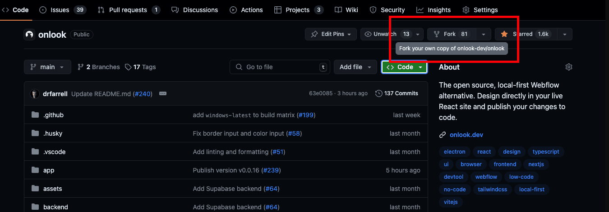
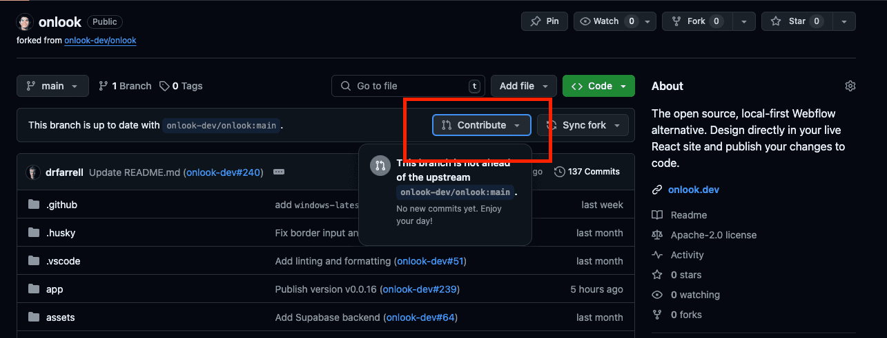

# Contributing

When contributing to this repository, please first discuss the change you wish to make via [issues](https://github.com/onlook-dev/onlook/issues),
[Discord](https://discord.gg/hERDfFZCsH), [email](mailto:contact@onlook.com), or any other method with the owners of this repository before making a change. 

Please note we have a [code of conduct](./CODE_OF_CONDUCT.md), please follow it in all your interactions with the project.

## Pull Request Process

1. To create a Pull Request (PR), [create a fork](https://docs.github.com/en/pull-requests/collaborating-with-pull-requests/working-with-forks/fork-a-repo) of the project. 

2. Create your changes in your fork and [open a PR from that fork.](https://docs.github.com/en/pull-requests/collaborating-with-pull-requests/proposing-changes-to-your-work-with-pull-requests/creating-a-pull-request-from-a-fork)

3. Update the PR description with details of the changes. Link the issue if relevant.
4. Request a review of one of the maintainers. Once accepted, they will be able to merge your PR. 

## Style guide

We try to follow guidelines from [Clean Code](https://gist.github.com/wojteklu/73c6914cc446146b8b533c0988cf8d29) and the boy scoute rule: 

"Leave the code cleaner, not messier, than how you found it". 
