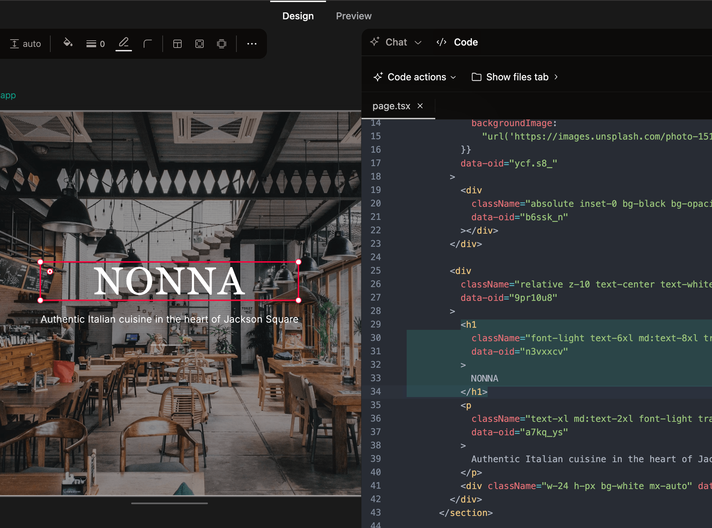

<!-- Improved compatibility of back to top link: See: https://github.com/othneildrew/Best-README-Template/pull/73 -->

<h3 align="center">Onlook</h3>
  

    Cursor for Designers
     
    <a href="https://docs.onlook.com"><strong>Explore the docs »</strong></a>
     
  

  

    👨‍💻👩‍💻👨‍💻
    <a href="https://www.ycombinator.com/companies/onlook/jobs/e4gHv1n-founding-engineer-fullstack">We're hiring engineers in SF!</a>
    👩‍💻👨‍💻👩‍💻
  

     
    <a href="https://youtu.be/RSX_3EaO5eU?feature=shared">View Demo</a>
    ·
    <a href="https://github.com/onlook-dev/onlook/issues/new?labels=bug&template=bug-report---.md">Report Bug</a>
    ·
    <a href="https://github.com/onlook-dev/onlook/issues/new?labels=enhancement&template=feature-request---.md">Request Feature</a>
  

  <!-- PROJECT SHIELDS -->
<!--
*** I'm using markdown "reference style" links for readability.
*** Reference links are enclosed in brackets [ ] instead of parentheses ( ).
*** See the bottom of this document for the declaration of the reference variables
*** for contributors-url, forks-url, etc. This is an optional, concise syntax you may use.
*** https://www.markdownguide.org/basic-syntax/#reference-style-links
-->
<!-- [![Contributors][contributors-shield]][contributors-url]
[![Forks][forks-shield]][forks-url]
[![Stargazers][stars-shield]][stars-url]
[![Issues][issues-shield]][issues-url]
[![Apache License][license-shield]][license-url] -->

[![Discord][discord-shield]][discord-url]
[![LinkedIn][linkedin-shield]][linkedin-url]
[![Twitter][twitter-shield]][twitter-url]

[中文](https://www.readme-i18n.com/onlook-dev/onlook?lang=zh) | 
[Español](https://www.readme-i18n.com/onlook-dev/onlook?lang=es) | 
[Deutsch](https://www.readme-i18n.com/onlook-dev/onlook?lang=de) | 
[français](https://www.readme-i18n.com/onlook-dev/onlook?lang=fr) | 
[Português](https://www.readme-i18n.com/onlook-dev/onlook?lang=pt) | 
[Русский](https://www.readme-i18n.com/onlook-dev/onlook?lang=ru) | 
[日本語](https://www.readme-i18n.com/onlook-dev/onlook?lang=ja) | 
[한국어](https://www.readme-i18n.com/onlook-dev/onlook?lang=ko)

# The Cursor for Designers – an Open-Source, Visual-First Code Editor

Craft websites, prototypes, and designs with AI in Next.js + TailwindCSS. Make
edits directly in the browser DOM with a visual editor. Design in realtime with
code. An open-source alternative to Bolt.new, Lovable, V0, Replit Agent, Figma
Make, Webflow, etc.

### 🚧 🚧 🚧 Onlook for Web is still under development 🚧 🚧 🚧

We're actively looking for contributors to help make Onlook for Web an
incredible prompt-to-build experience. Check the
[open issues](https://github.com/onlook-dev/onlook/issues) for a full list of
proposed features (and known issues), and join our
[Discord](https://discord.gg/hERDfFZCsH) to collaborate with hundreds of other
builders.

## What you can do with Onlook:

- [x] Create Next.js app in seconds
  - [x] Start from text or image
  - [ ] Use prebuilt templates
  - [ ] Import from Figma
  - [ ] Start from GitHub repo
- [x] Visually edit your app
  - [x] Use Figma-like UI
  - [x] Preview your app in real-time
  - [x] Manage brand assets and tokens
  - [x] Create and navigate to Pages
  - [ ] Browse layers – _Previously in
        [Onlook Desktop](https://github.com/onlook-dev/desktop)_
  - [ ] Detect and use Components – _Previously in
        [Onlook Desktop](https://github.com/onlook-dev/desktop)_
  - [ ] Manage project Images – _Previously in
        [Onlook Desktop](https://github.com/onlook-dev/desktop)_
- [x] Development Tools
  - [x] Real-time code editor
  - [x] Save and restore from checkpoints
  - [x] Run commands via CLI
  - [x] Connect with app marketplace
  - [ ] Edit code locally – _Previously in
        [Onlook Desktop](https://github.com/onlook-dev/desktop)_
- [ ] Deploy your app in seconds
  - [ ] Generate sharable links
  - [ ] Link your custom domain
- [ ] Collaborate with your team
  - [ ] Real-time editing
  - [ ] Leave comments

### Onlook for Desktop (aka Onlook Alpha)

We're in early preview for Onlook Web. If you're looking for the downloadable
desktop electron app, it's moved to
[Onlook Desktop](https://github.com/onlook-dev/desktop).

Why are we moving to the web? Read about our decision:
[Migrating from Electron to Web](https://docs.onlook.com/docs/developer/electron-to-web-migration)

## Getting Started

Available soon with a [hosted app](https://onlook.com) or
[run locally](https://docs.onlook.com/docs/developer/running-locally).

### Usage

Onlook will run on any Next.js + TailwindCSS project, import your project
into Onlook or start from scratch within the editor.

Use the AI chat to create or edit a project you're working on. At any time, you
can always right-click an element to open up the exact location of the element
in code.

 

Draw-in new divs and re-arrange them within their parent containers by
dragging-and-dropping.

 

Preview the code side-by-side with your site design.

 

Use Onlook's editor toolbar to adjust Tailwind styles, directly manipulate
objects, and experiment with layouts.

## Documentation

For full documentation, visit [docs.onlook.com](https://docs.onlook.com)

To see how to Contribute, visit
[Contributing to Onlook](https://docs.onlook.com/docs/developer/contributing) in
our docs.

## How it works

1. When you create an app, we load the code into a web container
2. The container runs and serves the code
3. Our editor receives the preview link and displays it in an iFrame
4. Our editor reads and indexes the code from the container
5. We instrument the code in order to map elements to their place in code
6. When the element is edited, we edit the element in our iFrame, then in code
7. Our AI chat also has code access and tools to understand and edit the code

This architecture can theoretically scale to any language or framework that
displays DOM elements declaratively (e.g. jsx/tsx/html). We are focused on
making it work well with Next.js and TailwindCSS for now.

For a full walkthrough, check out our
[Architecture Docs](https://docs.onlook.com/docs/developer/architecture).

### Our Tech Stack

#### Front-end

- [Next.js](https://nextjs.org/) - Full stack
- [TailwindCSS](https://tailwindcss.com/) - Styling
- [tRPC](https://trpc.io/) - Server interface

#### Database

- [Supabase](https://supabase.com/) - Auth, Database, Storage
- [Drizzle](https://orm.drizzle.team/) - ORM

#### AI

- [AI SDK](https://ai-sdk.dev/) - LLM client
- [Anthropic](https://ai-sdk.dev/) - LLM model provider
- [Morph Fast Apply](https://morphllm.com) - Fast apply model provider
- [Relace](https://relace.ai) - Fast apply model provider

#### Sandbox and hosting

- [CodeSandboxSDK](https://codesandbox.io/docs/sdk) - Dev sandbox
- [Freestyle](https://www.freestyle.sh/) - Hosting

#### Runtime

- [Bun](https://bun.sh/) - Monorepo, runtime, bundler
- [Docker](https://www.docker.com/) - Container management

## Contributing

If you have a suggestion that would make this better, please fork the repo and
create a pull request. You can also
[open issues](https://github.com/onlook-dev/onlook/issues).

See the [CONTRIBUTING.md](CONTRIBUTING.md) for instructions and code of conduct.

#### Contributors

## Contact

- Team: [Discord](https://discord.gg/hERDfFZCsH) -
  [Twitter](https://twitter.com/onlookdev) -
  [LinkedIn](https://www.linkedin.com/company/onlook-dev/) -
  [Email](mailto:contact@onlook.com)
- Project:
  [https://github.com/onlook-dev/onlook](https://github.com/onlook-dev/onlook)
- Website: [https://onlook.com](https://onlook.com)

## License

Distributed under the Apache 2.0 License. See [LICENSE.md](LICENSE.md) for more
information.

<!-- https://www.markdownguide.org/basic-syntax/#reference-style-links -->

[contributors-shield]: https://img.shields.io/github/contributors/onlook-dev/studio.svg?style=for-the-badge
[contributors-url]: https://github.com/onlook-dev/onlook/graphs/contributors
[forks-shield]: https://img.shields.io/github/forks/onlook-dev/studio.svg?style=for-the-badge
[forks-url]: https://github.com/onlook-dev/onlook/network/members
[stars-shield]: https://img.shields.io/github/stars/onlook-dev/studio.svg?style=for-the-badge
[stars-url]: https://github.com/onlook-dev/onlook/stargazers
[issues-shield]: https://img.shields.io/github/issues/onlook-dev/studio.svg?style=for-the-badge
[issues-url]: https://github.com/onlook-dev/onlook/issues
[license-shield]: https://img.shields.io/github/license/onlook-dev/studio.svg?style=for-the-badge
[license-url]: https://github.com/onlook-dev/onlook/blob/master/LICENSE.txt
[linkedin-shield]: https://img.shields.io/badge/-LinkedIn-black.svg?logo=linkedin&colorB=555
[linkedin-url]: https://www.linkedin.com/company/onlook-dev
[twitter-shield]: https://img.shields.io/badge/-Twitter-black?logo=x&colorB=555
[twitter-url]: https://x.com/onlookdev
[discord-shield]: https://img.shields.io/badge/-Discord-black?logo=discord&colorB=555
[discord-url]: https://discord.gg/hERDfFZCsH
[React.js]: https://img.shields.io/badge/react-%2320232a.svg?logo=react&logoColor=%2361DAFB
[React-url]: https://reactjs.org/
[TailwindCSS]: https://img.shields.io/badge/tailwindcss-%2338B2AC.svg?logo=tailwind-css&logoColor=white
[Tailwind-url]: https://tailwindcss.com/
[Electron.js]: https://img.shields.io/badge/Electron-191970?logo=Electron&logoColor=white
[Electron-url]: https://www.electronjs.org/
[Vite.js]: https://img.shields.io/badge/vite-%23646CFF.svg?logo=vite&logoColor=white
[Vite-url]: https://vitejs.dev/
[product-screenshot]: assets/brand.png
[weave-shield]: https://img.shields.io/endpoint?url=https%3A%2F%2Fapp.workweave.ai%2Fapi%2Frepository%2Fbadge%2Forg_pWcXBHJo3Li2Te2Y4WkCPA33%2F820087727&cacheSeconds=3600&labelColor=#131313
[weave-url]: https://app.workweave.ai/reports/repository/org_pWcXBHJo3Li2Te2Y4WkCPA33/820087727
