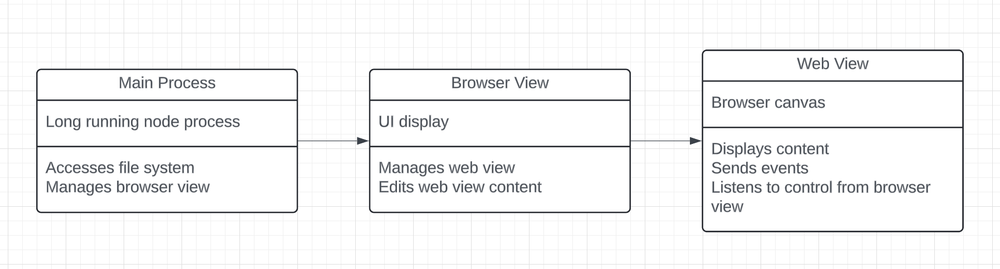

## High-level architecture

Typical electron architecture with an extra web view that holds the users' page



## Directory structure
```
├─┬ electron
| |
│ ├─┬ main              > Main Node process
│ │ └── index           
| |
│ └─┬ preload           > Injected scripts
│   └── browserview     > Browser view
│   └── webview         > Web view
|
├─┬ src                 > React front-end
│ └── routes            > Pages
│ └── lib               > Libraries
```