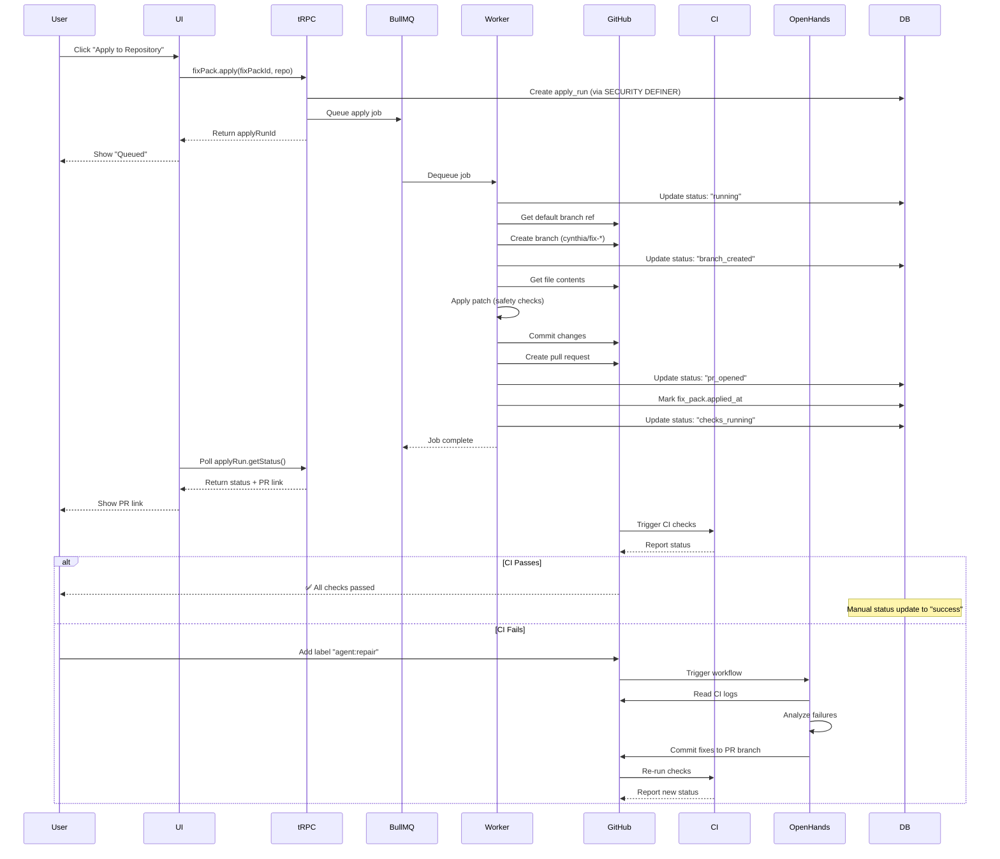

# Apply Fix Pack Pipeline - Phase 5

## Overview

The Apply Fix Pack Pipeline is Cynthia's autonomous ship loop that creates GitHub pull requests with fix pack patches and uses OpenHands to repair CI failures automatically.

## Architecture

### Components

1. **BullMQ + Redis**: Durable job queue for reliable background processing
2. **Apply Pipeline Service**: Core logic for GitHub PR creation
3. **GitHub App Integration**: OAuth-based GitHub API access
4. **OpenHands Repair Loop**: AI agent for automated CI failure repair
5. **tRPC API**: Type-safe endpoints for triggering and monitoring
6. **React UI**: User-facing controls and status display

### Data Flow



## Pipeline Stages

### 1. Initiation (User Action)

**Trigger**: User clicks "Apply to Repository" button

**Steps**:
1. UI prompts for `repoOwner` and `repoName`
2. Calls `fixPack.apply` tRPC mutation
3. Validates fix pack ownership
4. Creates `apply_run` record (status: `queued`)
5. Queues BullMQ job with idempotency key
6. Returns `applyRunId` to UI

**Files**:
- `apps/web/client/src/app/_components/apply-fix-pack/apply-button.tsx:42`
- `apps/web/client/src/server/api/routers/cynthia/fix-pack.ts:245`

### 2. Job Processing (BullMQ Worker)

**Trigger**: Worker dequeues job from `cynthia-apply` queue

**Steps**:
1. Update status: `running`
2. Create GitHub Octokit client
3. Fetch default branch SHA
4. Create new branch: `cynthia/fix-{type}-{timestamp}`
5. Update status: `branch_created`

**Files**:
- `apps/web/client/src/server/api/workers/apply-worker.ts:14`
- `apps/web/client/src/server/api/services/apply-pipeline-service.ts:263`

### 3. Patch Application (Safety Checks)

**Safety Checks**:
1. ✅ Verify file exists
2. ✅ Verify `before` substring exists exactly once
3. ✅ Apply deterministic string replacement
4. ❌ Fail if any check fails (rollback branch)

**Steps**:
1. For each diff in `patchPreview.diffs`:
   - Get current file content from branch
   - Run safety checks
   - Apply `before` → `after` replacement
   - Commit change with descriptive message
2. Track modified files

**Files**:
- `apps/web/client/src/server/api/services/apply-pipeline-service.ts:125`

### 4. Pull Request Creation

**Steps**:
1. Generate PR title from `fixPack.title`
2. Generate PR body with:
   - Fix pack description
   - Files changed list
   - Issues fixed list
   - Cynthia attribution
3. Create PR via GitHub API
4. Update status: `pr_opened`
5. Store `prNumber` and `prUrl`

**Files**:
- `apps/web/client/src/server/api/services/apply-pipeline-service.ts:188`

### 5. CI Monitoring

**Steps**:
1. Update status: `checks_running`
2. Mark `fix_pack.applied_at = now()`
3. Job completes successfully

**Manual Transitions** (Phase 5 scope):
- `checks_running` → `success`: When CI passes
- `checks_running` → `failed`: When CI fails

**Future** (Phase 6):
- Webhook listener for GitHub check_run events
- Automatic status updates

**Files**:
- N/A (manual for Phase 5)

### 6. OpenHands Repair Loop (Optional)

**Trigger**: User adds `agent:repair` label to PR

**Steps**:
1. GitHub Actions workflow triggers
2. Safety check: Verify branch starts with `cynthia/`
3. Fetch CI failure logs
4. Run OpenHands agent with task:
   - Read failure logs
   - Identify root cause
   - Make minimal fixes
   - Commit to PR branch only (never main)
5. Push repairs to PR branch
6. CI re-runs automatically
7. Remove `agent:repair` label

**Whitelisted Paths**:
- `apps/web/client/**`
- `packages/**`

**Blacklisted Paths**:
- `.env*`
- `*.key`
- `secrets/**`
- `billing/**`

**Files**:
- `.github/workflows/openhands-repair.yml:1`

## Database Schema

### `apply_runs` Table

| Column | Type | Description |
|--------|------|-------------|
| `id` | UUID | Primary key |
| `user_id` | UUID | Owner (foreign key) |
| `audit_id` | UUID | Source audit |
| `fix_pack_id` | UUID | Applied fix pack |
| `status` | enum | `queued`, `running`, `branch_created`, `pr_opened`, `checks_running`, `success`, `failed` |
| `repo_owner` | TEXT | GitHub repo owner |
| `repo_name` | TEXT | GitHub repo name |
| `branch` | TEXT | Git branch name |
| `pr_number` | INTEGER | GitHub PR number |
| `pr_url` | TEXT | GitHub PR URL |
| `logs` | JSONB | Execution logs array |
| `error` | TEXT | Error message (if failed) |

### SECURITY DEFINER Functions

#### `create_apply_run_record`
- Validates audit and fix pack ownership
- Creates apply run record
- Returns full apply run data

#### `update_apply_run_status`
- Validates ownership
- Updates status + metadata
- Atomic operation

**Files**:
- `apps/backend/supabase/migrations/2025_12_27_add_apply_runs.sql:1`

## tRPC API Endpoints

### `fixPack.apply`
**Type**: Mutation
**Auth**: Protected
**Input**: `{ fixPackId, repoOwner, repoName }`
**Output**: `{ applyRunId, jobId, status }`

**Flow**:
1. Verify fix pack ownership
2. Create apply run via `create_apply_run_record()`
3. Queue BullMQ job
4. Return applyRunId

**Files**:
- `apps/web/client/src/server/api/routers/cynthia/fix-pack.ts:245`

### `applyRun.getStatus`
**Type**: Query
**Auth**: Protected
**Input**: `{ id: applyRunId }`
**Output**: Full apply run record

**Files**:
- `apps/web/client/src/server/api/routers/cynthia/apply-run.ts:12`

### `applyRun.list`
**Type**: Query
**Auth**: Protected
**Input**: `{ limit?, offset? }`
**Output**: Array of apply runs

**Files**:
- `apps/web/client/src/server/api/routers/cynthia/apply-run.ts:57`

### `applyRun.listByAudit`
**Type**: Query
**Auth**: Protected
**Input**: `{ auditId }`
**Output**: Array of apply runs for audit

**Files**:
- `apps/web/client/src/server/api/routers/cynthia/apply-run.ts:92`

## BullMQ Configuration

### Queue: `cynthia-apply`

**Concurrency**: 2 (adjustable)
**Retry Policy**: 3 attempts with exponential backoff (2s, 4s, 8s)
**Idempotency**: Job ID = `apply-${applyRunId}`
**Retention**:
- Completed: 24 hours (last 100)
- Failed: 7 days

**Files**:
- `apps/web/client/src/server/api/services/queue-service.ts:34`

### Worker Initialization

**Location**: Server startup
**Auto-start**: Yes (when server starts)
**Graceful Shutdown**: Close workers, queues, Redis

**Files**:
- `apps/web/client/src/server/api/workers/apply-worker.ts:43`

## UI Components

### `ApplyFixPackButton`
**Props**: `{ fixPackId, fixPackTitle, onApplySuccess? }`

**Features**:
- Modal dialog for repo input
- Validation
- Loading states
- Success toast with applyRunId callback

**Files**:
- `apps/web/client/src/app/_components/apply-fix-pack/apply-button.tsx:1`

### `ApplyRunStatusPanel`
**Props**: `{ applyRunId, autoRefresh? }`

**Features**:
- Auto-polling (3s interval)
- Status badge with color coding
- PR link button
- Error display
- Expandable logs
- Timestamps

**Files**:
- `apps/web/client/src/app/_components/apply-fix-pack/status-panel.tsx:1`

## Environment Variables

### Required

| Variable | Description | Default |
|----------|-------------|---------|
| `REDIS_HOST` | Redis server host | `localhost` |
| `REDIS_PORT` | Redis server port | `6379` |
| `GITHUB_APP_ID` | GitHub App ID | - |
| `GITHUB_APP_PRIVATE_KEY` | GitHub App private key | - |
| `GITHUB_APP_SLUG` | GitHub App slug | - |

### Optional

| Variable | Description | Example |
|----------|-------------|---------|
| `GITHUB_INSTALLATION_ID` | Fallback installation ID | `12345678` |
| `OPENAI_API_KEY` | For OpenHands agent | `sk-...` |
| `ANTHROPIC_API_KEY` | For OpenHands agent | `sk-ant-...` |

**Files**:
- `apps/web/client/src/env.ts:64`

## Error Handling

### Common Failures

1. **GitHub Auth Failure**
   - Cause: Invalid installation ID or expired token
   - Status: `failed`
   - Error: "GitHub installation ID not configured"

2. **Branch Already Exists**
   - Cause: Concurrent apply runs
   - Status: `failed`
   - Error: "Branch already exists"

3. **Patch Application Failed**
   - Cause: `before` substring not found
   - Status: `failed`
   - Error: "Safety check failed: 'before' substring not found"

4. **PR Creation Failed**
   - Cause: Network error or permissions
   - Status: `failed`
   - Error: GitHub API error message

### Retry Logic

- **BullMQ**: Automatic retries (3 attempts)
- **Safety Checks**: No retries (fail fast)
- **Network Errors**: Exponential backoff

## Testing

### Local Development

1. **Start Redis**:
   ```bash
   docker run -d -p 6379:6379 redis:7-alpine
   ```

2. **Set Environment Variables**:
   ```bash
   export REDIS_HOST=localhost
   export REDIS_PORT=6379
   export GITHUB_APP_ID=your_app_id
   export GITHUB_APP_PRIVATE_KEY="$(cat private-key.pem)"
   ```

3. **Initialize Worker**:
   - Worker auto-starts with Next.js server
   - Monitor logs: `[Apply Worker] Job {id} completed`

4. **Trigger Apply**:
   - UI: Click "Apply to Repository"
   - CLI: Use tRPC direct call

### Manual Testing Checklist

- [ ] Queue job successfully
- [ ] Branch created with correct name
- [ ] Patches applied with safety checks
- [ ] PR created with correct body
- [ ] Status updates correctly
- [ ] Logs captured in database
- [ ] Error handling works
- [ ] OpenHands repair triggered by label
- [ ] Idempotency prevents duplicate jobs

## Monitoring

### Key Metrics

- Queue depth: `BullMQ.getJobCounts()`
- Processing time: Job duration
- Failure rate: Failed jobs / Total jobs
- PR success rate: `success` status / Total

### Logs

- **Worker**: Console logs with `[Apply Worker]` prefix
- **Pipeline**: Database `apply_runs.logs` JSONB
- **GitHub**: GitHub Actions logs for OpenHands

## Future Enhancements (Phase 6+)

1. **GitHub Webhooks**: Auto-update status from CI events
2. **Repair Queue**: Separate BullMQ queue for OpenHands jobs
3. **Multi-PR**: Apply multiple fix packs in one PR
4. **Conflict Resolution**: Handle merge conflicts automatically
5. **Rollback**: Revert failed applies
6. **Metrics Dashboard**: Real-time monitoring UI
7. **Slack Notifications**: Alert on PR creation/failures

## References

- Phase 5 Spec: ARCHITECT approval 2025-12-27
- BullMQ Docs: https://docs.bullmq.io
- OpenHands Docs: https://docs.all-hands.dev
- GitHub API: https://docs.github.com/rest
