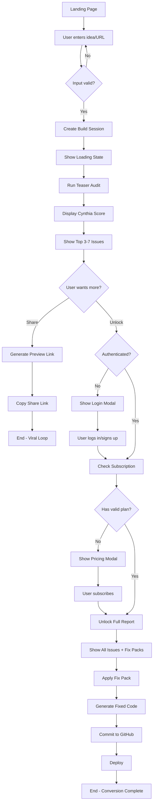
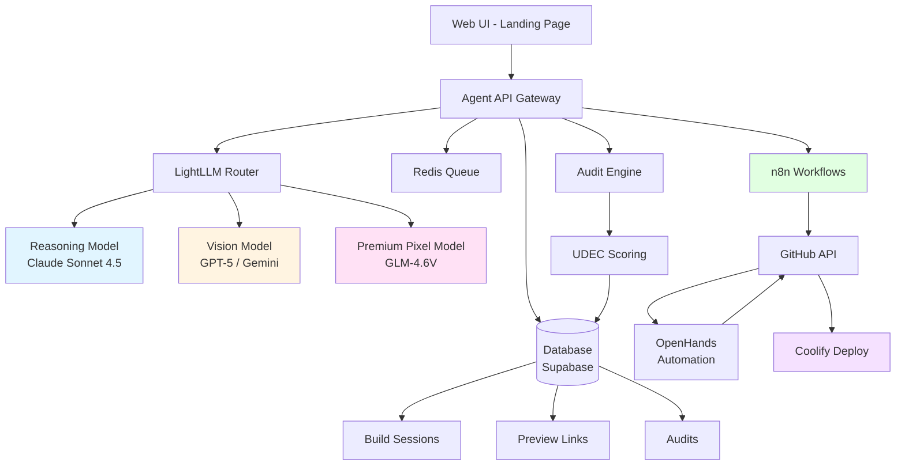
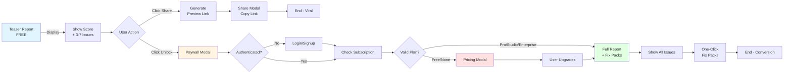

# Build My Site - User Flow & System Architecture

This document describes the "Build My Site" viral wedge flow for SYNTHIA 3.0, including user onboarding, system orchestration, and paywall gating.

## 1. User Onboarding Flow



## 2. System Orchestration

This diagram shows how different components work together to deliver the "Build My Site" experience.



## 3. Paywall Gating Flow



## 4. Data Model (Phase 2)

### Build Sessions Table

```sql
CREATE TABLE build_sessions (
    id UUID PRIMARY KEY DEFAULT gen_random_uuid(),
    user_id UUID REFERENCES users(id) ON DELETE CASCADE,
    project_id UUID REFERENCES projects(id) ON DELETE CASCADE,
    org_id UUID REFERENCES orgs(id) ON DELETE CASCADE,

    -- Input
    input_type VARCHAR(50) NOT NULL, -- 'idea' | 'url' | 'screenshot'
    input_value TEXT NOT NULL,
    language VARCHAR(10) DEFAULT 'en', -- user's preferred language

    -- Status
    status VARCHAR(50) DEFAULT 'pending', -- 'pending' | 'processing' | 'completed' | 'failed'

    -- Audit results
    audit_id UUID REFERENCES cynthia_audits(id),

    -- Preview
    preview_link_id UUID,

    -- Timestamps
    created_at TIMESTAMPTZ DEFAULT NOW() NOT NULL,
    updated_at TIMESTAMPTZ DEFAULT NOW() NOT NULL,
    completed_at TIMESTAMPTZ
);

CREATE INDEX idx_build_sessions_user ON build_sessions(user_id);
CREATE INDEX idx_build_sessions_status ON build_sessions(status);
```

### Preview Links Table

```sql
CREATE TABLE preview_links (
    id UUID PRIMARY KEY DEFAULT gen_random_uuid(),
    build_session_id UUID NOT NULL REFERENCES build_sessions(id) ON DELETE CASCADE,

    -- Link details
    short_code VARCHAR(20) UNIQUE NOT NULL, -- for URL: /preview/:short_code
    is_public BOOLEAN DEFAULT true,

    -- Metadata for sharing
    og_title TEXT,
    og_description TEXT,
    og_image_url TEXT,

    -- Analytics
    view_count INTEGER DEFAULT 0,
    share_count INTEGER DEFAULT 0,

    -- Expiration
    expires_at TIMESTAMPTZ,

    -- Timestamps
    created_at TIMESTAMPTZ DEFAULT NOW() NOT NULL,
    last_viewed_at TIMESTAMPTZ
);

CREATE INDEX idx_preview_links_short_code ON preview_links(short_code);
CREATE INDEX idx_preview_links_session ON preview_links(build_session_id);
```

## 5. API Endpoints (Phase 2)

### Build Session Management

```typescript
// Create a new build session
buildSession.create({
  inputType: 'url' | 'idea' | 'screenshot',
  inputValue: string,
  language?: string,
  context?: {
    productType?: string,
    audience?: string,
    goal?: string
  }
}) → BuildSession

// Get build session by ID
buildSession.get({ id: string }) → BuildSession

// Get teaser preview (free)
buildSession.getTeaser({ id: string }) → {
  id, status, score, topIssues, previewLinkId
}

// Get full results (requires subscription)
buildSession.getFull({ id: string }) → {
  id, fullIssues, fixPacks, patchPlan
}
```

### Preview Links

```typescript
// Generate shareable preview link
previewLink.create({
  buildSessionId: string,
  expiresIn?: number // days
}) → PreviewLink

// Get preview by short code (public)
previewLink.getByCode({ code: string }) → {
  buildSession, audit, metadata
}

// Track view/share
previewLink.trackView({ code: string }) → void
previewLink.trackShare({ code: string }) → void
```

## 6. Progressive Enhancement Strategy

### Phase 1 (Current - Landing Page)
- ✅ Hero with "Build My Site" input
- ✅ Static teaser demo section
- ✅ Bilingual EN/ES support
- ✅ Motion primitives applied
- ✅ Paywall UI components

### Phase 2 (Next - SaaS Foundation)
- [ ] Build sessions data model
- [ ] Preview links system
- [ ] Share functionality
- [ ] Analytics tracking

### Phase 3 (Integration)
- [ ] Wire landing demo to real audit API
- [ ] Implement paywall subscription checks
- [ ] Full report unlocking
- [ ] Fix pack application

### Phase 4 (Model Routing)
- [ ] LightLLM gateway integration
- [ ] Multi-model orchestration
- [ ] Cost tracking per task
- [ ] Fallback routing

### Phase 5 (Autonomy)
- [ ] n8n workflow templates
- [ ] OpenHands GitHub automation
- [ ] Automated PR creation
- [ ] Deploy pipeline

### Phase 6 (Infrastructure)
- [ ] Coolify deployment setup
- [ ] Hostinger VPS configuration
- [ ] Production scaling
- [ ] Monitoring & alerts

### Phase 7 (Viral & White-Label)
- [ ] Viral share cards (OG images)
- [ ] Referral system
- [ ] White-label configuration
- [ ] Agency portal

## 7. Motion & Accessibility

All landing page components implement:

- **Staggered Reveals**: Items fade in with staggered delays (0.1s increments)
- **Scroll-based Animations**: `whileInView` triggers when elements enter viewport
- **Parallax Effects**: Subtle depth via motion transforms
- **Reduced Motion Support**:
  ```tsx
  const prefersReducedMotion = useReducedMotion();
  transition={{ duration: prefersReducedMotion ? 0 : 0.6 }}
  ```
- **Keyboard Navigation**: All interactive elements are keyboard accessible
- **Screen Reader Support**: Semantic HTML + ARIA labels where needed

## 8. i18n Implementation

### Language Detection
```typescript
// Server-side (apps/web/client/src/i18n/request.ts)
1. Check cookie: 'locale'
2. Fallback to Accept-Language header
3. Default to 'en'
```

### Message Files
```
apps/web/client/messages/
  ├── en.json  (English - authoritative)
  ├── es.json  (Spanish - ARCHITECT-approved copy)
  ├── ja.json  (Japanese - existing)
  ├── ko.json  (Korean - existing)
  └── zh.json  (Chinese - existing)
```

### Usage in Components
```tsx
import { useTranslations } from 'next-intl';

function Component() {
  const t = useTranslations('landing.hero');
  return <h1>{t('headline')}</h1>;
}
```

## 9. Error Handling & Edge Cases

### Build Session Failures
- Network timeout → Retry with exponential backoff
- Invalid input → Show inline validation error
- API error → Graceful fallback to sample data

### Preview Link Edge Cases
- Expired link → Show "Preview Expired" message with CTA to create new
- Invalid short code → 404 with redirect to landing
- Rate limiting → Queue with position indicator

### Audit Engine Failures
- Model unavailable → Route to fallback tier
- Parsing error → Attempt JSON repair
- Timeout → Return partial results with "incomplete" flag

## 10. Success Metrics (to be tracked)

### Viral Loop
- Preview link creation rate
- Share conversion rate (views → shares)
- Referral attribution

### Conversion Funnel
- Landing → Teaser: __%
- Teaser → Login: __%
- Login → Upgrade: __%
- Upgrade → Fix Applied: __%
- Fix Applied → Deploy: __%

### Engagement
- Average time on teaser report
- Fix pack application rate
- GitHub commit success rate

---

This architecture supports the SYNTHIA 3.0 viral wedge strategy while maintaining extensibility for future autonomous features (n8n, OpenHands, white-label, etc.).
