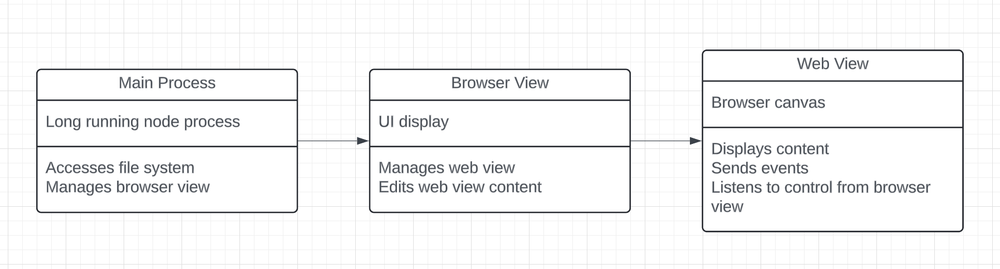

## High-level architecture

Typical electron architecture with an extra web view that holds the users' page



## Directory structure
```
app ────┐       > Electron app
        |
        ├─┬ electron            
        | |
        │ ├─┬ main              > Main Node process
        │ │ └── index           
        | |
        │ └─┬ preload           > Injected scripts
        │   └── browserview     > React front-end entry point
        │   └── webview         > The window inside of canvas
        |
        └─┬ src                 > React front-end
          ├── routes            > Pages
          └── lib               > Libraries
demos ──┐ 
        │     
        ├── babel               > React demo app using nextjs
        └── next                > React demo app using nextjs

plugins ┐                       > Plugin library to instrument projects
        │     
        ├── babel 
        └── next

docs ────       > Docs React app

cli ─────       > Npx script for setup

```